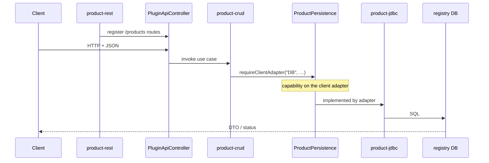
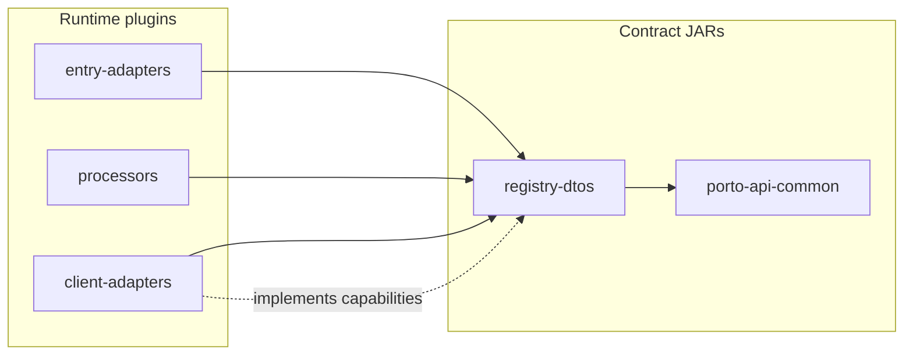

# Registry product — plugin architecture

First registry entity: **Product**. This document describes the plugin modules, data contract, request flow, configuration, and build layout for the registry application on porto-api.

## Data flow

```
Client (JSON)
    → Host PluginApiController (matches a route registered by product-rest)
    → Business processor plugin (rules + orchestration, no HTTP)
    → requireClientAdapter("DB", ProductPersistence.class)
    → Client adapter plugin (JDBC / SQL, or any other implementation)
    → Database (registry)
```

**DTOs** are shared shapes. **Capability interfaces** (`ProductPersistence`, …) live in `registry-dtos` next to those shapes. Processors resolve any client adapter by connector hook — JDBC today, REST/CSV later — without a separate ports module.



## Product fields

Aligned with `products.csv` used by porto-mpos and porto-smart-ui (`~/projects/porto-mpos/database/products.csv`):

| Field | Type | Required | Notes |
|-------|------|----------|-------|
| `id` | Integer | read / update | Auto-generated on create |
| `barcode` | String | yes (update) | EAN-13; optional on create if auto-generate is enabled |
| `description` | String | yes | Display name |
| `unitPrice` | BigDecimal | yes | |
| `discount` | BigDecimal | no | Default `0` |
| `taxRate` | BigDecimal | no | Default `0` |
| `unit` | String | yes | e.g. `ea` |
| `imageURL` | String | no | Relative path, e.g. `/products/{barcode}.png` |
| `category` | String | yes | Category id (matches `categories.csv`) |
| `enabled` | Boolean | no | Default `true` |

CSV header reference (porto-mpos `ProductCsv`):

```
ID,Barcode,Description,UnitPrice,Discount,TaxRate,Unit,ImageURL,Category,Enabled
```

## Database schema (Liquibase)

Table `products` under `config/registry/db/registry/changelog/`:

```yaml
# changeSet: products-table
columns:
  - id:            INT, PK, auto-increment
  - barcode:       VARCHAR(32), NOT NULL
  - description:   VARCHAR(255), NOT NULL
  - unit_price:    DECIMAL(19,4), NOT NULL
  - discount:      DECIMAL(19,4), NOT NULL, default 0
  - tax_rate:      DECIMAL(19,4), NOT NULL, default 0
  - unit:          VARCHAR(16), NOT NULL
  - image_url:     VARCHAR(512)
  - category:      VARCHAR(32), NOT NULL
  - enabled:       BOOLEAN, NOT NULL, default true
```

## Plugin module layout

Mirror [porto-mpos](../porto-mpos) multi-module layout. Plugin sources live in a sibling Maven reactor **`porto-api-plugins`**; the Spring Boot host stays in **`porto-api`**.

```
~/projects/
├── porto-api/                         # Spring Boot host (this repo)
│   ├── config/registry/               # which plugins to load for registry app
│   └── plugins/                       # deployed JARs at runtime
│       ├── common/
│       ├── dtos/
│       ├── dtos/
│       ├── datasources/
│       ├── entry-adapters/
│       ├── processors/
│       └── client-adapters/
│
└── porto-api-plugins/                 # plugin monorepo
    ├── porto-api-common/              # shared SPI (all API apps)
    └── registry/
        ├── dtos/registry-dtos/        # DTOs + ProductPersistence, CategoryPersistence
        ├── datasources/registry-db/
        ├── entry-adapters/product-rest/
        ├── entry-adapters/category-rest/
        ├── processors/product-crud/
        ├── processors/category-crud/
        ├── client-adapters/product-jdbc/
        └── client-adapters/category-jdbc/
```

Each plugin module copies its JAR into `porto-api/plugins/{type}/` on `mvn package`, same pattern as `product-csv` in porto-mpos:

```xml
<!-- maven-antrun-plugin: package phase -->
<copy file="${project.build.directory}/${project.build.finalName}.jar"
      tofile="${project.basedir}/../../../porto-api/plugins/dtos/${project.build.finalName}.jar"/>
```

### Why separate contract modules?

| Module | What belongs here | What does **not** |
|--------|-------------------|-------------------|
| `porto-api-common` | Host/plugin SPI reused by every API app (`HostContext`, `RequestContext`, `RouteRegistrar`, generic `Persistence`, SQL helpers) | Registry entity fields |
| `registry-dtos` | JSON shapes **and** thin capability interfaces (`ProductPersistence`, …) used with `requireClientAdapter` | Concrete JDBC/SQL, HTTP handlers |

**Rule:** persistence (and other outbound) capability interfaces belong in `registry-dtos`, not in `*-jdbc` / other client-adapter modules. Processors need a shared `Class` token for:

```java
ProductPersistence persistence =
    requestContext.requireClientAdapter("DB", ProductPersistence.class);
```

If that interface lived only inside `product-jdbc`, `product-crud` would have to depend on the JDBC module and could not swap implementations via connector config alone. Keep the interface next to the DTOs it refers to; keep SQL and connection details in the client adapter.

That works for any client adapter that implements the capability — JDBC, REST, CSV, etc. `requireAdapter` is available for non-client adapters registered on the host.



### Plugin types and load order

| Order | Type | Directory | Loaded from |
|-------|------|-----------|-------------|
| 1 | Common / DTOs | `plugins/common/`, `plugins/dtos/` | `config/registry/dtos-dev.yaml` |
| 2 | Datasources | `plugins/datasources/` | `config/registry/datasources-dev.yaml` |
| 3 | Client adapters | `plugins/client-adapters/` | `config/registry/client-adapters-dev.yaml` |
| 4 | Processors | `plugins/processors/` | `config/registry/processors-dev.yaml` |
| 5 | Entry adapters | `plugins/entry-adapters/` | `config/registry/entry-adapters-dev.yaml` |

Contract JARs load first so entry, processor, and adapter plugins share the same types.

## DTO plugin (`registry-dtos`)

Package: `systems.porto.registry.dto`

| Type | Purpose |
|------|---------|
| `ProductDto` | Full product (response / read) |
| `CreateProductRequest` | POST body (`id` absent) |
| `UpdateProductRequest` | PUT body (`id` required) |
| `ProductPageResponse` | Paged list response |
| `CategoryDto` / create / update / page | Category equivalents |

Bean Validation on request types (`@NotBlank`, `@NotNull`, `@Positive`, …). Structural validation in the host; business rules in the processor.

## Capability interfaces (`registry-dtos`)

Package: `systems.porto.registry.persistence`

These are **not** a ports module and **not** persistence implementation. They are typed hooks so processors can call:

`requireClientAdapter("DB", ProductPersistence.class)`

while depending only on `registry-dtos` (plus `porto-api-common`). Client adapters implement them; processors must not import adapter classes.

| Interface | Extends | Implemented by |
|-----------|---------|----------------|
| `ProductPersistence` | `Persistence<ProductDto, Integer, CreateProductRequest, UpdateProductRequest>` | `product-jdbc` |
| `CategoryPersistence` | `Persistence<CategoryDto, Integer, CreateCategoryRequest, UpdateCategoryRequest>` | `category-jdbc` |

Generic CRUD helpers live on `systems.porto.api.persistence.Persistence` in **`porto-api-common`**. Entity interfaces only specialize the type parameters.

## HTTP routes (`product-rest` Maven module)

One REST Maven module per entity, decoupled from the processor. `product-rest` registers only `/products` paths and invokes `product-crud`.

Base path: `/api/v1.0.0`

| Method | Path | Operation | Request DTO |
|--------|------|-----------|-------------|
| `GET` | `/products` | `product-list` | `ProductPageRequest` (query) |
| `GET` | `/products/{id}` | `product-read` | path `id` |
| `GET` | `/products/search` | `product-search` | `ProductSearchRequest` |
| `POST` | `/products` | `product-create` | `CreateProductRequest` |
| `PUT` | `/products/{id}` | `product-update` | `UpdateProductRequest` |
| `DELETE` | `/products/{id}` | `product-delete` | path `id` |

## Business processor (`product-crud`)

Plugin id: `product-crud` (or split per operation: `product-create`, `product-list`, …)

Per-plugin config: `plugins/processors/product-crud-dev.yaml`

```yaml
connectors:
  - id: DB
    adapter: product-jdbc
properties:
  - key: page.default.size
    value: "8"
```

Processor responsibilities:

- Receive the validated DTO from the host (via `ApiContext`)
- Apply business rules (barcode validation when configured)
- Delegate persistence to `product-jdbc` client adapter
- Return the response DTO to the host

## Client adapter (`product-jdbc`)

Plugin id: `product-jdbc`

Implements `ProductPersistence` using a **named datasource** and **named SQL statements** from plugin config (no dialect SQL embedded in Java).

Per-plugin config: `plugins/client-adapters/product-jdbc-dev.yaml`

```yaml
configs:
  - key: datasource
    value: registry
  - key: sql.dialect
    value: postgres

queries:
  - dialect: postgres
    statements:
      - name: LIST_PRODUCT
        sql: |
          SELECT id, barcode, description, unit_price, discount, tax_rate, unit,
                 image_url, category_id, enabled
          FROM products
          ORDER BY id
          LIMIT ? OFFSET ?
      # READ_PRODUCT, SEARCH_PRODUCT, INSERT_PRODUCT, …
  - dialect: mysql
    statements:
      - name: LIST_PRODUCT
        sql: |
          SELECT id, barcode, description, unit_price, discount, tax_rate, unit,
                 image_url, category_id, enabled
          FROM products
          ORDER BY id
          LIMIT ? OFFSET ?
```

At init the adapter loads the `statements` block for `sql.dialect` and fails if a required name is missing. Operations still map DTO ↔ rows:

- `list` → `LIST_PRODUCT` (+ count statement)
- `read` → `READ_PRODUCT`
- `search` → `SEARCH_PRODUCT`
- `create` / `update` / `delete` → matching statement names

Swap engine by changing `sql.dialect` (and ensuring Liquibase for that database supports the engine). Point at another database by changing `datasource` to a different id registered under `datasources-{env}.yaml`.

See [README — Databases](../README.md#databases) for multi-database layout and Liquibase-per-database.

## Plugin registries (registry app only)

Only plugins listed under `config/registry/` are loaded when `porto.api.application-path` points to `config/registry`.

### `dtos-dev.yaml`

```yaml
dtos:
  - id: registry-dtos
    version: 1.0.0
    label: Registry API DTOs
    description: Shared request/response types for registry application.
    jarFile: registry-dtos-1.0.0.jar
```

### `client-adapters-dev.yaml`

```yaml
client-adapters:
  - id: product-jdbc
    version: 1.0.0
    label: Product JDBC Adapter
    description: Persists products to the registry database.
    className: systems.porto.registry.adapter.jdbc.ProductJdbcAdapter
    dependencies:
      external:
        - jarFile: registry-dtos-1.0.0.jar
```

### `processors-dev.yaml`

```yaml
processors:
  - id: product-crud
    version: 1.0.0
    label: Product CRUD Processor
    description: Business logic for registry product operations.
    className: systems.porto.registry.processor.ProductCrudProcessor
    dependencies:
      external:
        - jarFile: registry-dtos-1.0.0.jar
```

### `entry-adapters-dev.yaml`

```yaml
entry-adapters:
  - id: product-rest
    version: 1.0.0
    label: Product REST Entry Adapter
    description: REST routes for registry product APIs.
    className: systems.porto.registry.entry.rest.ProductRestEntryAdapter
    dependencies:
      external:
        - jarFile: porto-api-common-1.0.0.jar
```

The host **only** loads plugins declared in these files for the active application. Running `pos` later uses `config/pos/*-dev.yaml` instead — no cross-loading.

## Host responsibilities (porto-api)

The Spring Boot host provides:

| Concern | Owner |
|---------|--------|
| `DataSource` beans | Host (`registry-dev.yml`) |
| Liquibase migrations | Per database (`config/registry/db/{database-id}/changelog/`) via datasource plugin |
| `Validator` / `ObjectMapper` | Host |
| Plugin classloader + loader | Host (`PluginLoader` service) |
| Security / actuator | Host |
| Error JSON (`400`, `404`, `409`) | Host (`@ControllerAdvice`) |

Plugins do not use `@ComponentScan` or `@Autowired`; they receive `ApiContext` and host services through explicit initialization.

## Build and deploy

```bash
# 1. Install shared contracts
cd ~/projects/porto-core && mvn install -DskipTests

# 2. Build plugins (copies JARs into porto-api/plugins/)
cd ~/projects/porto-workspace/porto-api-plugins && mvn package

# 3. Run registry application
cd ~/projects/porto-workspace/hexagonalboot-api && ./mvnw spring-boot:run
```

Select registry plugins at build time by building only the `registry` aggregator in `porto-api-plugins`. The host JAR is always the same; runtime behaviour is driven by `config/api-dev.yml` (application path) and the YAML registries under `config/registry/`.

## Validation

| Stage | Where | Examples |
|-------|-------|----------|
| Structural | Entry adapter + DTO annotations | `@NotBlank description`, `@Positive unitPrice` |
| Business | Processor | EAN-13 check digit, in-house barcode prefix, duplicate barcode |
| Database | Client adapter | Unique constraint on `barcode`, FK to `categories` (future) |

## Related code references

- Product CSV adapter: `porto-mpos/mpos-adapters/product-csv/.../ProductCsv.java`
- Product CSV data: `porto-mpos/database/products.csv`
- Registry UI product functions: `porto-smart-ui/plugins/functions/product-registry-dev.yaml`
- porto-core contracts: `EntryAdapter`, `ClientAdapter`, `BusinessProcessor`

## Implementation status

| Component | Status |
|-----------|--------|
| Host + config hierarchy | Done |
| `registry-dtos` plugin | Done |
| `product-rest` / `category-rest` entry adapters | Done |
| `product-crud` processor | Done |
| `product-jdbc` client adapter | Done |
| `products` Liquibase table | Done |
| Host `PluginRuntime` | Done |
